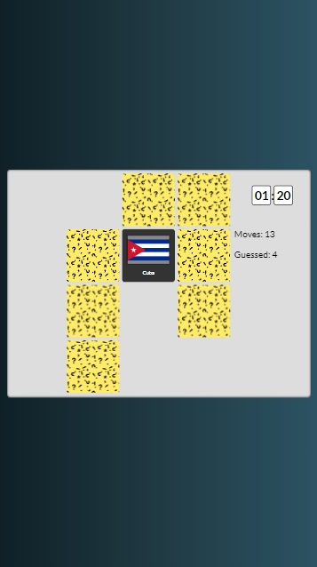
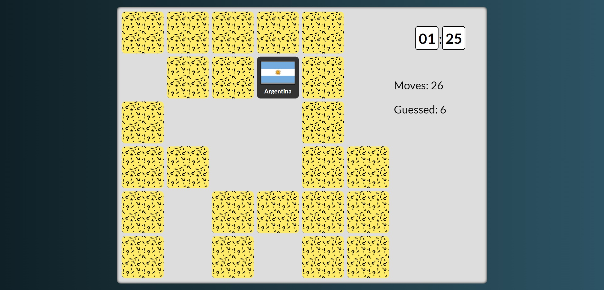

# Memory
Simple mind game for everyone.

## Table of contents
* [General info](#general-info)
* [Technologies](#technologies)
* [Live demo](#live-demo)
* [Screenshots](#screenshots)

## General info
Memory is a simple game to find pairs of identical cards. Every card has country flag and name. There is a hundred of countries, which you can draw in your game. There is 3 levels of difficulties: easy (8 pairs), medium (18 pairs), hard (32 pairs), which you can choose before the game. Once the game is over, you will be informed about your result (time and moves to win). The game was written to play on desktop, but it's also possible to play on mobile with quite good quality.

## Technologies
* HTML5
* CSS3
* Sass
* JavaScript
* OOP
* Webpack

## Live demo
[Click here](https://www.mobbyschiller.com/)

## Screenshots

